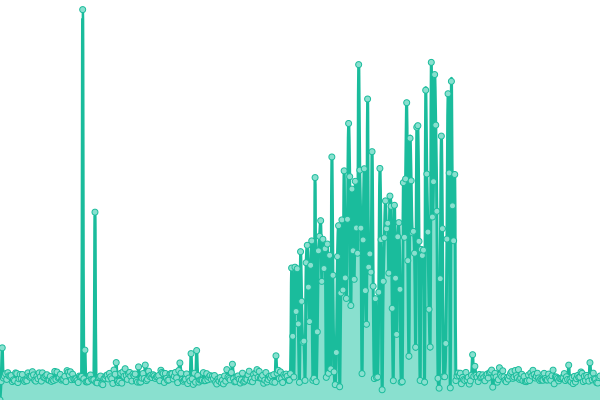
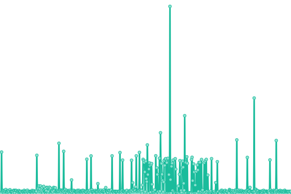
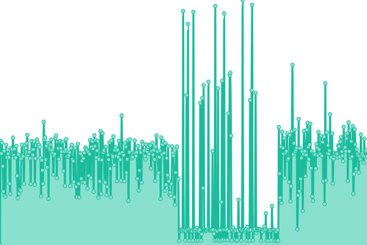
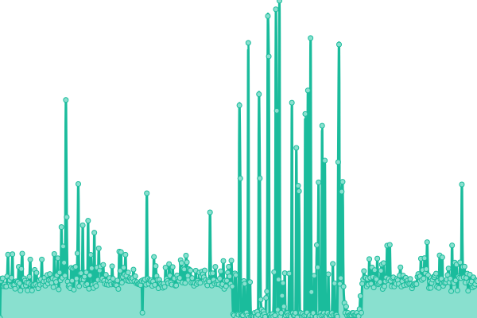

# Infra Status Page

This repository contains the open-source uptime monitor and status page for [The Pins Team](https://madebythepins.tk), powered by [Upptime](https://github.com/upptime/upptime).

With [Upptime](https://upptime.js.org), you can get your own unlimited and free uptime monitor and status page, powered entirely by a GitHub repository. We use [Issues](https://github.com/MadeByThePinsHub/are-we-down/issues) as incident reports, [Actions](https://github.com/MadeByThePinsHub/are-we-down/actions) as uptime monitors, and [Pages](https://MadeByThePinsHub.github.io/are-we-down) for the status page.

<!--start: status pages-->
<!-- This summary is generated by Upptime (https://github.com/upptime/upptime) -->
<!-- Do not edit this manually, your changes will be overwritten -->
<!-- prettier-ignore -->
| URL | Status | History | Response Time | Uptime |
| --- | ------ | ------- | ------------- | ------ |
|  [GitLab Pages-hosted Main Website](https://madebythepins.tk) | 🟩 Up | [git-lab-pages-hosted-main-website.yml](https://github.com/MadeByThePinsHub/are-we-down/commits/HEAD/history/git-lab-pages-hosted-main-website.yml) | 

 905ms
     
 | 

<a href="https://MadeByThePinsHub.github.io/are-we-down/history/git-lab-pages-hosted-main-website">100.00%</a>
    

|  [Community Forum](https://community.madebythepins.tk) | 🟥 Down | [community-forum.yml](https://github.com/MadeByThePinsHub/are-we-down/commits/HEAD/history/community-forum.yml) | 

 0ms
     
 | 

<a href="https://MadeByThePinsHub.github.io/are-we-down/history/community-forum">0.00%</a>
    

|  [Recap Time Website](https://recaptime.tk) | 🟥 Down | [recap-time-website.yml](https://github.com/MadeByThePinsHub/are-we-down/commits/HEAD/history/recap-time-website.yml) | 

 425ms
     
 | 

<a href="https://MadeByThePinsHub.github.io/are-we-down/history/recap-time-website">89.76%</a>
    

|  [Handbook Website](https://en.handbooksbythepins.gq) | 🟩 Up | [handbook-website.yml](https://github.com/MadeByThePinsHub/are-we-down/commits/HEAD/history/handbook-website.yml) | 

 761ms
     
 | 

<a href="https://MadeByThePinsHub.github.io/are-we-down/history/handbook-website">100.00%</a>
    

|  [LPDM Handbook (hosted on Divio)](https://repohubdev.tk) | 🟩 Up | [lpdm-handbook-hosted-on-divio.yml](https://github.com/MadeByThePinsHub/are-we-down/commits/HEAD/history/lpdm-handbook-hosted-on-divio.yml) | 

 882ms
     
 | 

<a href="https://MadeByThePinsHub.github.io/are-we-down/history/lpdm-handbook-hosted-on-divio">90.37%</a>
    

|  [Bitwarden Vault instance (powered by BitwardenRS on Divio)](https://vault.madebythepins.tk) | 🟩 Up | [bitwarden-vault-instance-powered-by-bitwarden-rs-on-divio.yml](https://github.com/MadeByThePinsHub/are-we-down/commits/HEAD/history/bitwarden-vault-instance-powered-by-bitwarden-rs-on-divio.yml) | 

 504ms
     
 | 

<a href="https://MadeByThePinsHub.github.io/are-we-down/history/bitwarden-vault-instance-powered-by-bitwarden-rs-on-divio">100.00%</a>
    

|  [Public Link Shortener (powered by thedevs-network/Kutt)](https://rtapp.tk) | 🟥 Down | [public-link-shortener-powered-by-thedevs-network-kutt.yml](https://github.com/MadeByThePinsHub/are-we-down/commits/HEAD/history/public-link-shortener-powered-by-thedevs-network-kutt.yml) | 

 0ms
     
 | 

<a href="https://MadeByThePinsHub.github.io/are-we-down/history/public-link-shortener-powered-by-thedevs-network-kutt">100.00%</a>
    

|  [Community Lores Website](https://community-lores.gq) | 🟩 Up | [community-lores-website.yml](https://github.com/MadeByThePinsHub/are-we-down/commits/HEAD/history/community-lores-website.yml) | 

 517ms
     
 | 

<a href="https://MadeByThePinsHub.github.io/are-we-down/history/community-lores-website">99.81%</a>
    

<!--end: status pages-->

[View our status website](https://madebythepinshub.github.io/are-we-down) if you want to see the graphs in larger size, among other things.

## Documentation and links

- For team members, please see TODO.
- For configuration, please see <https://upptime.js.org/docs/configuration>
- Reporting downtimes? Please report straight to [our GitLab issue tracker](https://gitlab.com/MadeByThePinsHub/infra-ops/AreWeDown/issues/new) instead.

## 📄 License

- Powered by: [Upptime](https://github.com/upptime/upptime)
- Code: [MIT](./LICENSE) © [The Pins Team](https://madebythepins.tk)
- Data in the `./history` directory: [Open Database License](https://opendatacommons.org/licenses/odbl/1-0/)
